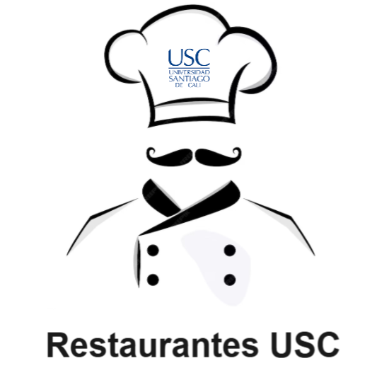

# 📱 App Restaurantes USC



Sistema de gestión de pedidos y reservas para los restaurantes de la **Universidad Santiago de Cali (USC)**. Esta app permite a los estudiantes ordenar y reservar comida con tokens virtuales, mientras los administradores gestionan menús y pedidos de forma eficiente.

---

## 🚀 Instalación de la App

### 📲 Android (Instalación interna)
 
Escanea el siguiente código QR con la cámara de tu dispositivo:


O haz clic en el siguiente enlace para instalarla directamente en tu Android:

👉 [https://expo.dev/accounts/jmolina7/projects/AppRestaurantes/builds/80f29d78-22f9-4b7e-8293-d04294dd09e0](https://expo.dev/accounts/jmolina7/projects/AppRestaurantes/builds/80f29d78-22f9-4b7e-8293-d04294dd09e0)

### ⚠️ Nota para Android 8.0+
Debes permitir instalaciones de fuentes desconocidas:
- **Android 8.0+**: Ajustes ➜ Apps ➜ Permitir instalación desde el navegador.
- **Android 7.1.1 o menor**: Ajustes ➜ Seguridad ➜ Orígenes desconocidos.

---

## 🎯 Objetivo del Proyecto

Desarrollar una aplicación móvil que permita:
- A los **restaurantes USC**: gestionar menús, recibir y confirmar pedidos.
- A los **estudiantes USC**: ordenar comida y reservar horarios, pagando con tokens virtuales.

---

## 📦 Funcionalidades Clave

### 👑 Súper Usuario (Administrador general)
- ➕ Agrega, edita o elimina restaurantes.
- 👥 Administra cuentas de restaurantes.
- 💰 Monitorea transacciones de tokens.

### 🍽️ Usuario Administrador (Restaurantes USC)
- 📄 Registra y actualiza la info de su restaurante.
- 🍲 Gestiona su menú (agrega/edita/elimina platillos con imágenes y precios).
- 📦 Visualiza y confirma pedidos.
- ⏰ Establece horarios de recogida.

### 🎓 Usuario Normal (Estudiantes)
- 🔍 Explora restaurantes y menús.
- 🛒 Ordena comida.
- 💳 Paga usando tokens (20 tokens iniciales al registrarse).
- 📅 Reserva horario para recoger pedido.
- 📜 Consulta historial de pedidos y saldo de tokens.

---

## 🔐 Requerimientos No Funcionales

- **⏱️ Rendimiento**: Procesa órdenes en menos de 3 segundos.
- **🔒 Seguridad**:
  - Uso de HTTPS.
  - Cifrado de credenciales.
  - Control de acceso por roles.
- **🧑‍💻 Usabilidad**:
  - Diseño intuitivo y accesible.
  - Mensajes claros.
- **🔧 Mantenibilidad**:
  - Código modular y documentado.
  - Actualización de menús en tiempo real.

---

## 🛠️ Detalles Técnicos

| Tecnología            | Versión      |
| --------------------- | ------------ |
| **Expo SDK**          | 52.0.42      |
| **React Native**      | 0.76.8       |
| **Firebase**          | 11.7.1       |
| **Firebase Auth & Firestore** | SDK Web oficial |
| **Router**            | expo-router 4.0.19 |
| **Lenguaje**          | JavaScript & TypeScript |
| **Estado del Proyecto** | 🟢 En desarrollo activo |

### 📚 Principales Librerías
- Navegación: `@react-navigation`
- Base de datos: `firebase` (Firestore + Auth)
- Almacenamiento local: `@react-native-async-storage`
- UI & Animaciones: `expo`, `react-native-reanimated`, `expo-blur`, `expo-haptics`

### 📜 Scripts disponibles
```bash
npm run start       # Inicia el proyecto en modo desarrollo
npm run android     # Ejecuta en Android
npm run ios         # Ejecuta en iOS
npm run web         # Ejecuta en navegador
npm run test        # Ejecuta tests
npm run lint        # Corre el linter
eas build -p android --profile preview  # Generar ejecutable 
```

## 👫 Autores
Juan David Rivera

Jose David Molina
